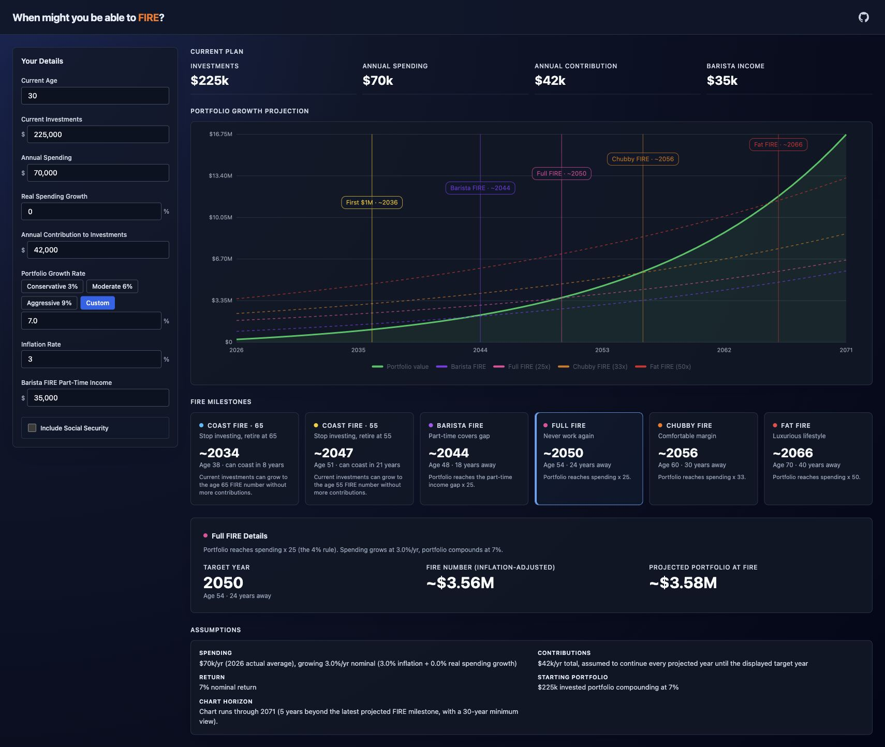

# FIRE Calculator

A simple, standalone calculator for exploring when you might be able to reach different FIRE milestones.

By default, all data stays local and does not leave your browser.



## What It Shows

- When your investments may reach Barista, Full, Chubby, and Fat FIRE.
- When you may be able to Coast FIRE.
- How inflation, annual contributions, and portfolio growth affect the timeline.
- A portfolio projection chart with key milestone markers.

<ins>The numbers are estimates, not financial advice.</ins> Small changes to return, inflation, spending, or contributions can move the results by years.

## Main Assumptions

- Portfolio growth is a nominal annual return.
- Annual contributions continue through the projected timeline.
- Spending grows with inflation, plus any real spending growth you enter.
- FIRE targets are based on spending multiples:
  - Full FIRE: `25x` annual spending
  - Chubby FIRE: `33x` annual spending
  - Fat FIRE: `50x` annual spending
  - Barista FIRE: `25x` the gap after part-time income

## Google Analytics

Google Analytics is configured through the GA4 measurement ID in `index.html`:

```html
<meta name="google-analytics-id" content="G-XXXXXXXXXX">
```

The integration avoids sending calculator values or shareable hash input data. It only sends a sanitized page view plus interaction events for updated field names and selected milestone types.

## Contributors

- `vwmj` - original inspiration

---

Google Analytics may be used to understand aggregate usage patterns. User-provided calculator data is not shared and does not leave the tool.
