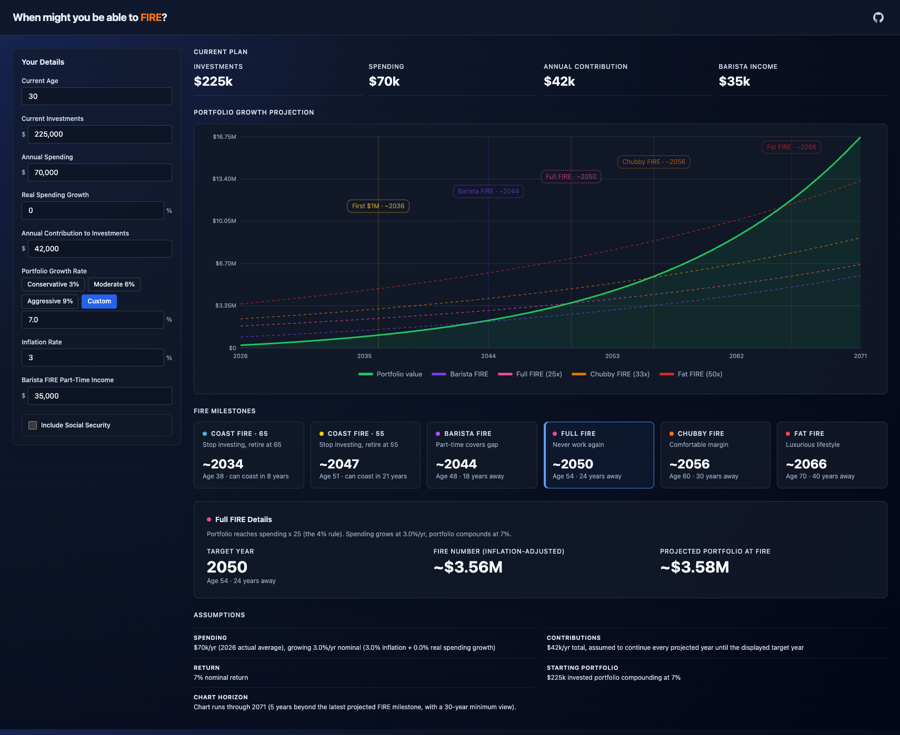

# FIRE Calculator

A simple, standalone calculator for exploring when you might be able to reach different FIRE milestones.

By default, all data stays local and does not leave your browser.



## What It Shows

- When your investments may reach Barista, Full, Chubby, and Fat FIRE.
- When you may be able to Coast FIRE.
- How inflation, monthly contributions, and portfolio growth affect the timeline.
- A portfolio projection chart with key milestone markers.
- A retirement view with monthly withdrawals, a chosen retirement age, and a planning horizon.

**Savings Targets** is the default chart view and contains the accumulation milestones and their details. Switch to **Retirement** to explore withdrawals under a separate plan.

<ins>The numbers are estimates, not financial advice.</ins> Small changes to return, inflation, spending, or contributions can move the results by years.

## Main Assumptions

- Portfolio growth defaults to Moderate (6%), a constant nominal annual return. The equivalent monthly return is `(1 + annual return)^(1/12) - 1`; market volatility is not modeled.
- Contributions are fixed nominal monthly amounts added at each month end. They stop at your chosen retirement age in **Retirement** and continue throughout **Savings Targets**. Each milestone assumes contributions continue until its own date; later milestones do not describe what happens after choosing an earlier retirement date.
- Spending grows by `(1 + inflation) * (1 + real spending growth)` each year.
- Part-time income and Social Security benefits are entered in today's dollars and grow with inflation. Social Security reduces the spending target starting at the selected claiming age; enter a benefit estimate appropriate to that age and your expected work history.
- FIRE targets are based on spending multiples:
  - Full FIRE: `25x` annual spending
  - Chubby FIRE: `33x` annual spending
  - Fat FIRE: `50x` annual spending
  - Barista FIRE: `25x` the gap after part-time income
- Chubby FIRE describes an upper-middle-class retirement, as outlined in [r/ChubbyFIRE's community definition](https://www.reddit.com/r/ChubbyFIRE/comments/1knom7l/defining_leanfire_fire_chubbyfire_fatfire_2025/). Fat FIRE describes an affluent retirement with fewer spending constraints, as discussed in [r/fatFIRE](https://www.reddit.com/r/fatFIRE/comments/1oh7xd4/mentor_monday/). This calculator uses 33x and 50x of the same spending need as planning targets; increase Annual Spending to model the lifestyle you want. The other milestone descriptions follow the general meanings outlined by [Schwab](https://advisorservices.schwab.com/story/fire-movement).
- Coast FIRE compares the portfolio at the contribution stop date with the amount needed to grow to the retirement-age target without further contributions or withdrawals. The details show both balances separately. Past retirement ages are marked **Not Applicable**.
- If the first qualifying Coast FIRE year is the retirement year itself, the card says the retirement target is reached with no separate coasting period projected. Its details show a **Retirement Target Year** instead of a contribution stop year. Annual checkpoints may miss a shorter coasting period between years.
- Milestones are checked at annual intervals for up to 60 years, with Coast FIRE limited to its target age. **Not Reached** means no crossover was found within that window.
- Missed targets show a dollar shortfall on their card and a target-versus-portfolio comparison in their details. Coast FIRE compares balances at the retirement age; other milestones compare at the end of the 60-year search. These are future-dollar amounts assuming monthly contributions continue through the comparison date, with no withdrawals. Passed Coast retirement ages are not assigned a shortfall.

## Retirement Projection

Choose a retirement age (default 55) and an ending age (default 95). The projection stops when you reach that age; it does not include the following year of spending. After retirement, the portfolio earns the equivalent monthly return, then pays a month-end withdrawal for spending left after income. Spending and income adjust annually, including after retirement. Enabled Social Security offsets withdrawals from its claiming age; before then, savings cover the gap. Part-time income is optional in this view and continues until the planning age shown beside its checkbox. The Current Plan summary identifies excluded part-time income and enabled Social Security. Surplus income is not reinvested.

The balance stops at zero. The first month savings cannot cover the full withdrawal is reported as a shortfall age. **Spending Covered** describes only the selected horizon under steady-return assumptions, not a probability of success. A portfolio can still grow when returns exceed withdrawals.

Retirement balances default to today's dollars (future balances divided by cumulative inflation). Switching to future dollars changes display values, not cashflows or the shortfall age. Annual checkpoints show balances at each age and the spending and income rates for the following year. **Savings Targets** keeps the original accumulation chart in future dollars.

## What the Calculator Does Not Test

Reaching a spending multiple does not establish whether your money will last through retirement. The model does not simulate changing market returns or calculate a probability of success. Part-time income has no modeled end date. Chubby and Fat FIRE use the same spending plan with higher multiples; they do not assume a different lifestyle budget. Taxes, investment fees, RMDs, healthcare changes, and account-access rules are not separately modeled. Account for relevant costs in spending and returns.

## Using the Calculator

Valid inputs are kept in browser session storage for the current tab so refresh does not discard your plan. **Reset Plan** restores defaults and clears any shared-input fragment. A different shared-input link takes precedence over the previous draft; subsequent edits to that link survive refresh. If tab storage is blocked, the calculator still works and shows that refresh will reset the plan.

Growth presets and milestone buttons expose their selected state to assistive technology. On small screens, **View Results** and **Edit Plan** jump between inputs and the projection without changing saved or shared inputs. The milestone carousel starts on the selected card; **Previous** and **Next** change the selected milestone and its details.

Hover over the chart or use its arrow keys, Home, and End to inspect years. Numbered chart markers map to a selectable key with milestone names, years, and ages; milestones at the same annual checkpoint share one number. Selecting a FIRE marker also selects its details. A shared marker opens the highest FIRE level reached and offers buttons for the other levels in that year. A touch selection stays visible after release; use **Clear Chart Selection** or Escape to dismiss it. Chart labels use compact billion, trillion, and scientific formats when needed. Part-time income is an annual amount in today's dollars.

## Input Validation

Invalid entries show an error and leave results based on the last valid value. Fractional percentages remain visible when editing and after leaving a field. Shared input links accept only known fields with valid types and ranges; invalid shared values fall back to defaults with a notice. Older links using `annualInvesting` are converted to monthly amounts by dividing by 12; an explicit `monthlyInvesting` value takes precedence. The default contribution is $3,500/month ($42,000/year).

- Current age: whole years from 0 to 120.
- Retirement and ending ages: whole years up to 200. Retirement must be at or after the current age, and the ending age must be later than retirement.
- Social Security claiming age: whole years from 62 to 70.
- Money: $0 to $1 trillion.
- Portfolio return: -100% to 100%; inflation and real spending growth: above -100% through 100%.

These are supported input bounds, not recommended assumptions.

## Tests

Run the dependency-free numerical and input regression tests with Node.js:

```sh
node --test tests/calculator.test.cjs
```

## Google Analytics

Google Analytics is configured through the GA4 measurement ID in `index.html`:

```html
<meta name="google-analytics-id" content="G-XXXXXXXXXX">
```

The integration avoids sending calculator values or shareable hash input data. It only sends a sanitized page view plus interaction events for updated field names and selected milestone types.

## Contributors

- `vwmj` - original inspiration

---

Google Analytics may be used to understand aggregate usage patterns. User-provided calculator data is not shared and does not leave the tool.
